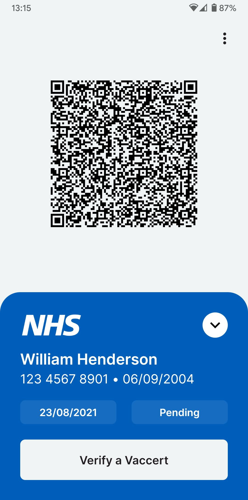
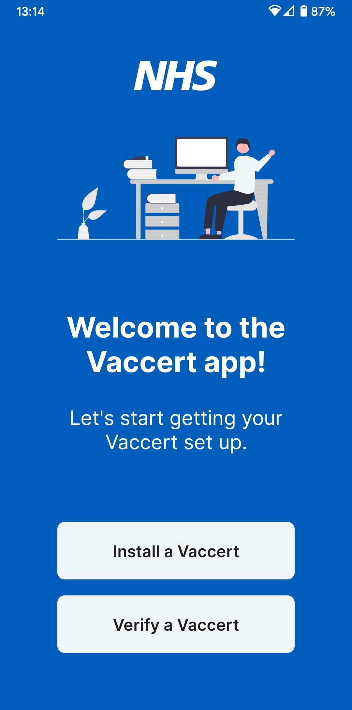
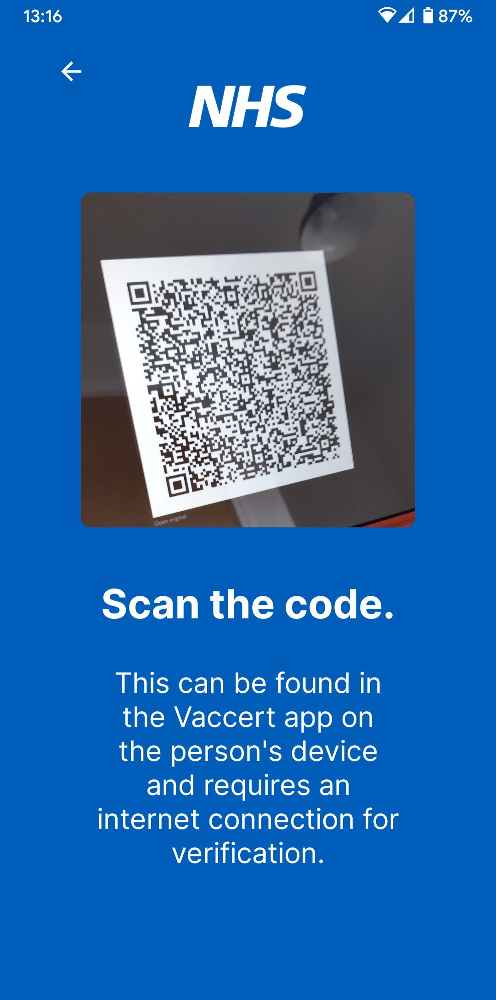
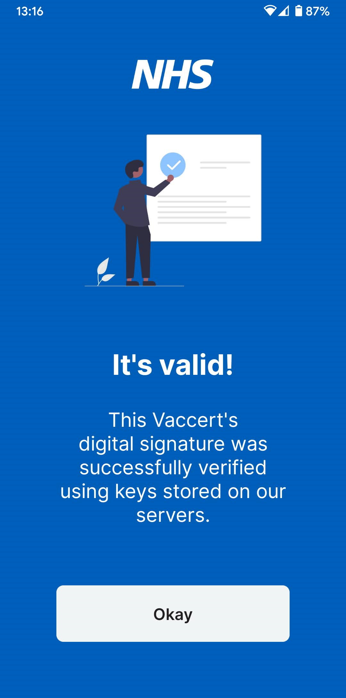
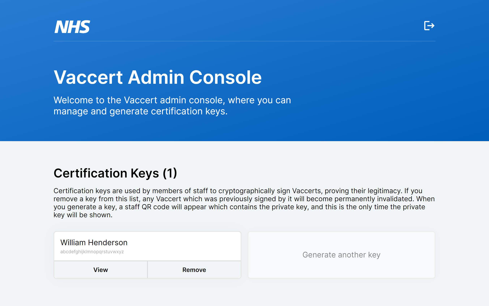
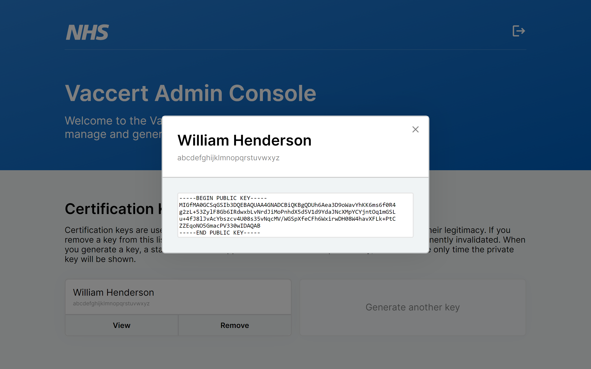
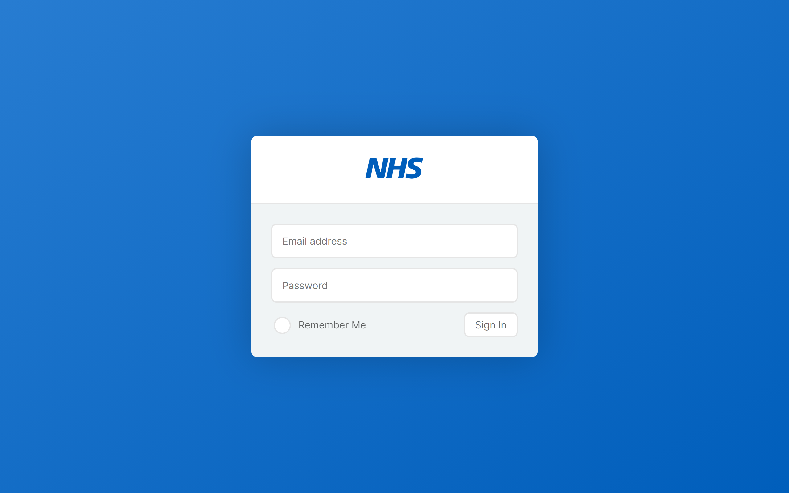
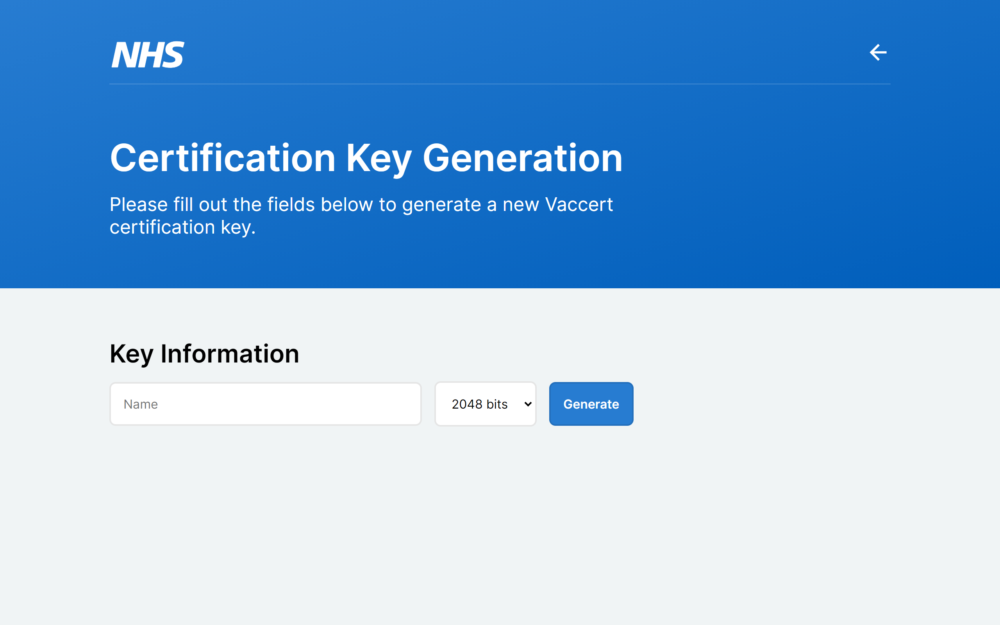
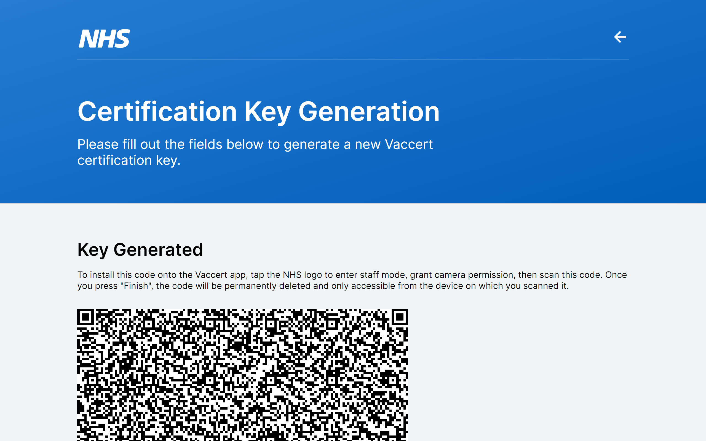

    
  
  
    

# Vaccert
Vaccert is a cryptography-based vaccine certification app, built with React Native. It works in exactly the same way as the [EU Digital COVID Certificate](https://ec.europa.eu/info/live-work-travel-eu/coronavirus-response/safe-covid-19-vaccines-europeans/eu-digital-covid-certificate_en) and the [NHS COVID Pass](https://www.nhs.uk/conditions/coronavirus-covid-19/covid-pass/), but is faster, has a more modern and accessible UI, provides verification capabilities in the same app, and is completely open-source. The one Vaccert app can be used by citizens to prove their vaccination status and verify those of others, as well as by NHS staff to issue and sign vaccination certificates. It also provides a simple and easy-to-use interface for managing staff private keys.

## Overview
When a person is vaccinated, a member of NHS staff will open the Vaccert app and create a new certificate. The person's name, date of birth, and NHS number will be entered, along with details of the vaccination. The certificate will then be signed using a private key stored only on the member of staff's device, and a QR code will be generated for the person to scan, importing the certificate onto their device where it will be saved.

If the person is later asked for proof of vaccination, for example when travelling abroad, they will open the Vaccert app and show their QR code. The person requesting proof will also open the Vaccert app and press the "Verify a Vaccert" button. When they scan the person's QR code, their device will retrieve the corresponding public key from the online database, and use this to verify the certificate's signature. If this process is successful, the Vaccert app will show that the certificate is valid.

## Running Locally

### Prerequisites
- [Node](https://nodejs.org/en/)
  - [NPM](https://www.npmjs.com/)
  - [expo-cli](https://docs.expo.dev/workflow/expo-cli/) (install with `npm i -g expo-cli`)
- [Rust](https://www.rust-lang.org/)
  - [Cargo](https://crates.io/)
  - [wasm-pack](https://github.com/rustwasm/wasm-pack) (install with `cargo install wasm-pack`)

### Firebase Setup
1. Create a new Firebase project and add a web app to it
2. Store the credentials in `.env` as described in [`keystore.ts`](https://github.com/w-henderson/Vaccert/blob/master/src/crypto/keystore.ts).
3. The credentials also need to be accessible from the admin console, so they must also be stored in `admin/.env` as described in the admin console's [`App.tsx`](https://github.com/w-henderson/Vaccert/blob/master/admin/src/App.tsx).
4. Enable Realtime Database and email/password authentication.
5. Create one user with an email address and a password, and copy their UID.
6. Set up the database rules as stored in [`database-rules.json`](https://github.com/w-henderson/Vaccert/blob/master/database-rules.json).
7. Create one value in the database called `admin` with your UID as its value.

### React Native App Setup
1. Install dependencies with `npm i` in the project directory.
2. Start the app with `npm start`.

### React Admin Console Setup
1. Install dependencies with `npm i` in the `admin/` directory.
2. Start the app with `npm start` (this will automatically compile the Rust to WASM).

## Tech Stack
- [React Native](https://reactnative.dev/) mobile app
  - [Expo](https://expo.dev/) toolchain
  - [JSEncrypt](https://github.com/travist/jsencrypt) RSA implementation
  - [CryptoJS](https://github.com/brix/crypto-js) SHA-256 implementation
- [React](https://reactjs.org/) admin console
  - [create-react-app](https://create-react-app.dev/) toolchain
  - [Rust RSA](https://github.com/RustCrypto/RSA) RSA key generation (compiled to WASM)
- [Firebase](https://firebase.google.com/)
  - [Realtime Database](https://firebase.google.com/products/realtime-database) to store public keys for verification

## Screenshots

### Mobile App
| | | | |
| --- | --- | --- | --- |
|  |  |  |  |

### Admin Console
| | | |
| --- | --- | --- |
|  |  |  |

| | |
| --- | --- |
|  |  |

## Disclaimer
Vaccert is in no way endorsed by the NHS, Department of Health and Social Care, or any other body. The NHS logo and name are trade marks owned by the Secretary of State for Health and Social Care and are reproduced here to show what Vaccert would look like in production use by the NHS. The logo was obtained from the MIT-licensed [`nhsuk/nhsuk-frontend`](https://github.com/nhsuk/nhsuk-frontend/blob/1f95b401b1d6d86fbe4b4d81835d08180760c365/packages/components/header/template.njk) repository as an SVG and was then modified and converted to a PNG in compliance with the license. Copyright for source repository: *Copyright (c) 2019 NHS Digital*.